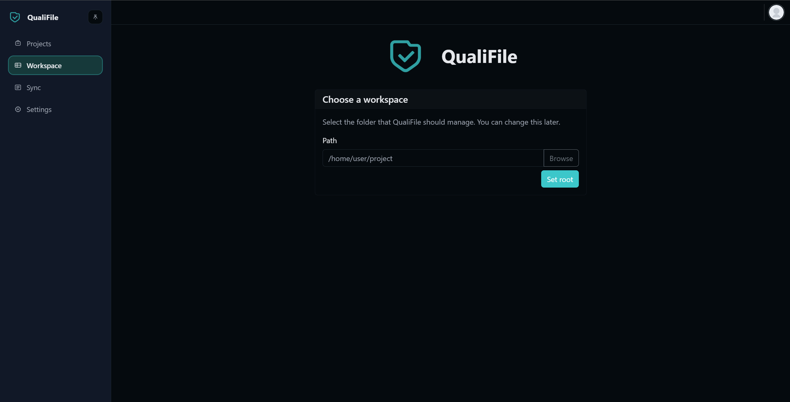
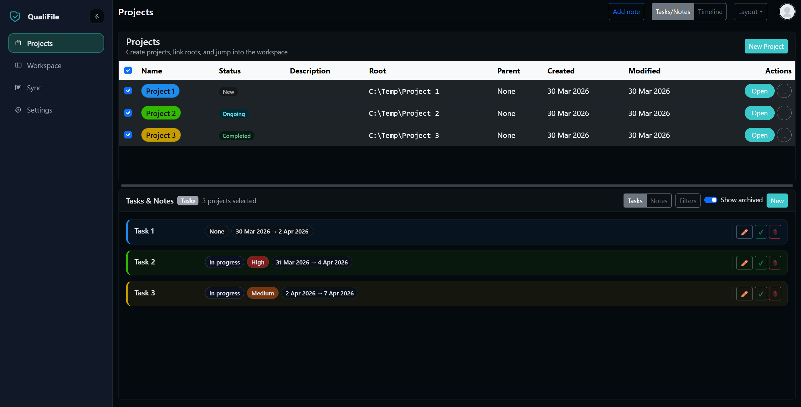

# QualiFile

QualiFile is a Flask application for managing a local file workspace with
previews, metadata, validation flags, project tracking, and Windows portable
packaging.

## Features

- Workspace explorer with folder navigation, filtering, sorting, and file operations
- Preview support for text, code, images, PDFs, and Office documents
- PDF and image utilities for merge, extraction, capture, and annotation flows
- Notes, tags, sidecar metadata, and per-file validation tracking
- Projects, linked roots, tasks/notes, timeline, reminders, and alerts
- Git Sync Manager for project metadata export/import and repo actions

## Interface Preview

QualiFile opens with a focused workspace selection flow, then expands into a
project-centric dashboard for linked roots, tasks, notes, and timeline work.

### Workspace Selection

The first screen keeps setup minimal: choose the root folder QualiFile should
manage and start working inside a contained local workspace.



### Projects And Tasks Dashboard

The projects view brings project tracking,
status visibility, and task/note management into a single screen.



- [Open screenshot 3](.github/assets/readme/sc3.png)
- [Open screenshot 4](.github/assets/readme/sc4.png)

## Requirements

- Python 3.10 or newer for source runs
- Source validated against Python 3.10 and 3.12 syntax
- Windows is the primary platform, portable builds are Windows-only
- Office previews require Windows, Microsoft Office, and `pywin32`

## Install

```bash
python -m pip install -r requirements.txt
python -m flask --app run.py --debug run
```

Open `http://127.0.0.1:5000` and choose a workspace root.

## Portable Builds

```bash
python -m pip install -r requirements/portable_build.txt
build_portable.bat
build_portable_embedded.bat
```

Portable builds bundle minified frontend assets, the user tutorial, and
vendored offline web assets under `dist/`.

## Project Structure

- `app/` Flask app, blueprints, feature modules, templates, and static assets
- `docs/` tutorial assets, schema registry, portable notices, and third-party notices
- `packaging/` Windows launchers and PyInstaller specs
- `tools/` asset and portable build helpers
- `requirements/` runtime and packaging dependency sets

## Support

QualiFile is currently maintained for personal use and is not accepting
external contributions. Bug reports, questions, and feature requests should go
through [GitHub Issues](https://github.com/CrowDomus/QualiFile/issues).

## License

QualiFile is licensed under Business Source License 1.1. Personal and other non-production use is allowed. Commercial and production use requires a license from the licensor.
